# trial-by-doc ⚖️

**An OCR / document-intelligence model gauntlet.** Wire in any model — a classic
CPU OCR engine, a local open-weights VLM, a commercial doc-AI API, or a frontier
VLM — and run it through a three-tier benchmark gauntlet with **deterministic,
automatic scoring**. Built to answer one question honestly: *which model should you
trust to parse your documents?* The roster spans the full cost/quality spectrum, from
a CPU engine that costs cents per thousand pages to a 7B VLM on an A100.

- **Tier A — parse fidelity**: is the OCR output actually correct? (unit tests, edit distance, TEDS)
- **Tier B — downstream extraction**: is it good enough to extract fields from? (exact match, ANLS)
- **Tier C — document segmentation**: can it split a PDF that is really 3–4 merged documents? (boundary F1, PQ, STP)

No LLM-as-judge anywhere. Every score is a deterministic algorithm; the only LLMs in
the measurement path are **frozen instruments** (pinned revision, temp=0, seeded,
identical for every model) and the scoreboard marks where they're used.

**Contents:** [Bottom line](#bottom-line) · [Recommendations](#recommendations) · [Benchmarks](#benchmarks) · [Scores](#scores) · [Dashboard](#dashboard) · [Scanned/faxed robustness](#scanned-and-faxed-robustness-tier-b-under-degradation) · [Example documents](#example-documents) · [Models](#models) · [What the harness is](#what-the-harness-actually-is) · [Setup](#setup) · [Hardware](#hardware) · [Gaps](#gaps) · [Glossary](#glossary) · [Credits](#attributions--credits)

## Bottom line

If you only read one section, read this — everything below backs these claims with numbers.

- **No single model wins everything.** VLMs (olmocr2, dots_ocr) are the strongest raw OCR
  (Tier A parse fidelity). On document-splitting (Tier C) the classic CPU engines lead —
  but the honest headline is that **splitting is unsolved on this bench**: only the four
  classic engines beat the trivial pixel-diff floor (0.226), and *every VLM scores below
  it* (see [Tier C floors](#tier-c-floor-baselines-most-models-fail-them)). A plausible
  mechanism is steadier per-page text vs. VLM over-merging, but the boundary-judge
  instrument only reads a window of each page, so treat the *why* as unconfirmed.
- **The B.1 extraction lead is a four-way tie.** olmocr2 (0.689), doctr (0.682),
  lightonocr (0.658), and qwen25vl (0.637) are statistically indistinguishable on
  RealDoc-QA — paired bootstrap CIs span 0 even for the 0.689-vs-0.637 spread
  ([findings/statistical-significance.md](findings/statistical-significance.md)). olmocr2
  is the top pick on *cross-benchmark consistency* (it also leads Tier A), not on a B.1
  margin. docTR earning a spot in that group while being a free CPU engine is the standout.
- **Scanned/faxed input changes the ranking.** olmocr2 and gemma4 hold onto 75–80% of their
  clean-document accuracy under heavy degradation; tesseract and easyocr collapse to 22–29%.
  If your documents arrive scanned or faxed, don't trust the clean-benchmark numbers alone —
  see [Scanned and faxed robustness](#scanned-and-faxed-robustness-tier-b-under-degradation).
- **Cost spans three orders of magnitude** — $0.057/1k pages (tesseract, CPU) to $10.60/1k
  pages (gemma4, single-stream A100) — and the [Dashboard](#dashboard)'s value frontier shows
  which of those are actually worth paying for.
- **Quick picks**: cleanest raw OCR → **olmocr2** (olmocr_bench) / **dots_ocr** (omnidocbench)
  · cheapest that's still competitive → **tesseract** / **docTR** · best if input is
  scanned/faxed → **olmocr2** / **gemma4** · document-splitting → **easyocr** leads (0.397),
  but no model clears the bar we'd call "solved" (the bench itself is provisional pending a
  human spot-check — see its [VALIDATION.md](benchmarks/custom/merged_forms/VALIDATION.md)).
  The full decision guide is in [Recommendations](#recommendations) below.

## Recommendations

Which model to actually deploy depends on three things: **your input** (clean digital PDFs,
scanned/faxed, or a mix), **your deployment budget** (CPU-only, one commodity GPU, or an
A100), and **your task** (field extraction vs. faithful full-page reconstruction). Pick the
row that matches your hardest constraint. Every claim below is backed by the scored data and,
where it's a close call, a paired-bootstrap significance test
([findings/statistical-significance.md](findings/statistical-significance.md)); "mixed" =
the mean of clean / light-scan / heavy-scan B.1 extraction accuracy, the production task.

| Your constraint | Pick | Mixed B.1 | Cost /1k (batched) | Why |
|---|---|---|---|---|
| **Accuracy first, have an A100** | **olmocr2** | **0.620** | $1.19 (A100) | Best mixed extraction *and* best full-page fidelity; significantly most robust under heavy degradation |
| **Best value, one commodity GPU (T4)** | **lightonocr** | 0.556 | **$0.18** (T4) | Statistically ties olmocr2 on *clean* extraction at ~1/6 the cost; only gives ground under heavy scans |
| **Rock-bottom GPU cost** | **dots_ocr** | 0.507 | **$0.11** (T4) | Cheapest usable model; strong full-page fidelity (Tier A 0.734); still beats tesseract on mixed, significantly |
| **CPU-only / on-prem, extraction task** | **docTR** | 0.580 | $0.17 (CPU) / $0.04 (GPU) | Best CPU-capable *extractor*; 2× tesseract's scan-robustness — **but see the caveat, it can't reconstruct pages** |
| **Scanned/faxed-dominant** | **olmocr2** / **gemma4** | 0.620 / 0.534 | $1.19 / $1.08 (A100) | olmocr2 has the highest absolute heavy-scan score; gemma4 *retains* the most (80% of clean) |
| **Clean digital PDFs only, minimize cost** | **tesseract** | 0.382 | **$0.057** (CPU) | Cheapest of all, competitive B.1 on clean input — but collapses the moment scans appear |
| **Faithful full-page markdown (tables, math, layout)** | **olmocr2** / **dots_ocr** | — | $1.19 / $0.11 | Tier-A leaders (0.836 / 0.734); do **not** use docTR or tesseract here |

### Justification for the headline picks

**olmocr2 — the accuracy pick.** It is 1st on both axes that matter: full-page parse fidelity
(Tier A olmocr_bench 0.836, well clear of the field) and mixed-input field extraction (0.620).
Crucially, its robustness lead is *real*, not a rounding artifact — under heavy scan/fax
degradation it scores 0.514 vs the next-best 0.451, and the paired-bootstrap gap over qwen25vl
(+0.078) and docTR (+0.116) excludes zero. If accuracy is the priority and an A100 is available,
this is the defensible default. The cost — $1.19/1k pages batched, ~20× tesseract — is the price.

**lightonocr — the value pick, and the one most people should look at first.** On *clean*
documents its extraction is **statistically indistinguishable from olmocr2** (Δ=0.031, CI
[−0.05, +0.11] — a tie), yet it runs on a **T4 instead of an A100** at **$0.18/1k, roughly
one-sixth the cost**. The gap to olmocr2 only opens under *heavy* degradation (+0.106, significant),
so if your inputs skew clean-to-moderate, you are paying 6× for a difference you won't see. It
also keeps 62% of its clean accuracy under heavy scans (vs tesseract's 30%) and beats tesseract
significantly at every degradation level. Among the cheap-GPU tier it's the best extractor —
it significantly out-extracts dots_ocr (+0.109 on clean).

**docTR — the CPU pick, with one hard caveat.** For a no-GPU, on-prem, or cost-floored
deployment doing **field extraction**, docTR is the standout classic engine: mixed B.1 0.580
(3rd overall, ties the top extraction group), 58% scan-retention (2× tesseract), Apache-2.0,
and pennies per thousand pages. **But it cannot reconstruct a page** — its Tier A full-page
fidelity is 0.185, near the bottom (olmocr2 beats it there by +0.651, a chasm), because it
emits plain text lines with no tables, math, or layout. Use docTR when you need *values pulled
out*; never when you need *faithful markdown of the whole document*.

**tesseract — only for clean input.** It's the cheapest model in the roster and competitive at
clean-document extraction (B.1 0.580), but it drops from 6th to 11th of 13 once scanned input
enters the mix, retaining just 30% of its accuracy under heavy degradation. For any mixed or
scan-heavy pipeline, docTR (CPU) or lightonocr/dots_ocr (cheap GPU) strictly and significantly
outperform it — the entire reason this section exists.

### Can these be improved? (fine-tuning / RL)

Two of the recommended picks have clear headroom, and the harness is built to measure whether
tuning actually pays off:

- **docTR** is the most tractable: its recognition backbone is a config knob
  (`reco_arch`, currently the lightweight `crnn_vgg16_bn`; stronger transformer recognizers
  `parseq` / `vitstr_base` ship in the same package), and Mindee provides fine-tuning scripts
  for its detection and recognition heads — the direct way to lift it on your domain's fonts and
  scan profile. Swapping the backbone is a one-line `configs/models.yaml` change that produces a
  fresh, provenance-stamped run you can A/B against the baseline with `gauntlet scoreboard --ci`.
- **The VLMs** (olmocr2, lightonocr, qwen25vl) are LoRA/full-fine-tunable; olmocr2 itself is a
  fine-tune of Qwen2.5-VL on OCR data, so the ceiling is real.
- **RL is a natural fit**: this harness's deterministic scorers (B.1 field-presence, Tier-A
  edit-distance) are exactly the verifiable reward signals RLVR needs, so the eval gauntlet can
  double as the reward model. That said, **training is a deliberate next phase** — the harness
  today is an evaluation gauntlet with no training loop (see the Phase-2 gate in `CLAUDE.md`).

### Caveats on these recommendations

- Extraction figures are **RealDoc-QA B.1** (deterministic, reader-free) — the production
  "pull the fields out" task. Full-page fidelity is a *separate* axis (Tier A); the table above
  keeps them distinct on purpose.
- "Mixed" weights clean / light / heavy equally. If your real split differs, recompute — the
  per-condition numbers are in [Scanned robustness](#scanned-and-faxed-robustness-tier-b-under-degradation).
- Degraded scores come from a **seeded synthetic** scan/fax pipeline, not real fax hardware;
  treat them as a controlled robustness ranking, not an absolute fax-accuracy promise.
- Costs are **self-host Azure estimates** at batched throughput ([docs/REFERENCE.md](docs/REFERENCE.md));
  single-stream and other clouds run higher. Re-price before committing.
- Adjacent ranks are often statistical ties — the guide leans on *significant* gaps; where two
  picks are close (e.g. lightonocr vs olmocr2 on clean) that's stated as a tie, not a winner.

## Benchmarks

> **New here?** Start here, before the Scores table — this section defines what Tier
> A / B / C actually measure, so the numbers read straight the first time. Unfamiliar
> terms (ANLS, TEDS, `judge_composed`, etc.) are collected in the [Glossary](#glossary).

| Benchmark | Tier | Provenance | What it tests | Why we test it |
|---|---|---|---|---|
| [olmOCR-Bench](https://huggingface.co/datasets/allenai/olmOCR-bench) | A | official | Per-page **unit tests**: text present/absent, reading order, math (KaTeX render), tables — across 7 doc categories incl. old scans | The broadest "did you transcribe this correctly" signal; scans + multi-column are production reality |
| [OmniDocBench](https://github.com/opendatalab/OmniDocBench) | A | official | Full-page parse quality: text/formula/table **edit distance**, **TEDS** table structure, over 10 document sources | The industry-standard parse-fidelity metric set |
| [RealDoc-Bench QA](https://huggingface.co/datasets/Extend-AI/RealDoc-Bench) | B | official | **Field extraction** from business docs (finance, medical, mortgage, supply-chain): markdown → frozen extractor → exact-match/ANLS | The closest proxy for "extract data from PDFs without mistakes" — the production task itself |
| [merged_forms](benchmarks/custom/merged_forms/VALIDATION.md) | C | **custom** | **Document segmentation**: streams of 3–4 concatenated NIST SD2 tax submissions — same form faces, different filled data; boundaries only detectable by content | The hard production case: splitting merged PDFs of look-alike forms. No public benchmark covers it (we verified) |

### Tier B in detail: B.1 (extraction) vs B.2 (comprehension)

Tier B is split so the signal you care about is isolated:

- **B.1 — extraction fidelity (primary, deterministic).** For each field question we check
  whether the *gold value* appears, unmangled, in the model's OCR markdown — with **no LLM in
  the loop**. This is the "does it capture the values without messing them up?" signal. It is
  scored only on the *extractive* subset (answers that are literally on the page); the
  `coverage` column shows how many items that is — see [Glossary](#glossary). Reproducible;
  needs no API key.
- **B.2 — comprehension (secondary).** A separate *reader* model answers the question from the
  markdown, scored deterministically (field-aware exact-match + ANLS). **The reader is a
  swappable instrument, never the model under test.** It defaults to a small local model
  (**Phi-4-mini**, `microsoft/Phi-4-mini-instruct`, MIT) deliberately — not because it's the
  strongest reader available, but so a fresh clone reproduces the full baseline with no API key
  and no spend. Claude Haiku 4.5 and GPT-5.4-mini are available via OpenRouter as stronger
  "ceiling" readers (`--reader haiku45` / `--reader gpt5mini`), and the older Qwen2.5-1.5B is
  kept as a labeled ladder rung. Because a capable reader can paper over OCR slips, **B.2 is
  confounded by the reader by design** — trust B.1 for extraction quality; read B.2 as a
  directional "does this feed a downstream QA step" signal. The reader-sensitivity study
  ([findings/partb-reader-ladder.md](findings/partb-reader-ladder.md)) quantifies the confound:
  swapping Phi-4-mini for gpt-5.4-mini moves B.2 exact-match by **~2.8×** (0.18 → 0.50) on the
  same fixed OCR input — the evidence for *why* B.2 is secondary, not a data quality bug.

  Each B.2 number in the [Scores](#scores) table below is stamped with the `reader` column that
  produced it. **The `v1-baseline` scoreboard predates the Phi-4-mini default switch** — its B.2
  column was scored with Qwen2.5-1.5B-Instruct (the reader in place at the time), not the current
  default. Read those B.2 numbers as historical: the same predictions have since been re-scored
  with gpt-5.4-mini as the reader — see the [re-scored B.2 table](#tier-b-b2-re-scored-with-an-api-grade-reader)
  under Scores (run `v1-b2-gpt5mini`, [findings/b2-gpt5mini-rescore.md](findings/b2-gpt5mini-rescore.md)).

Run `gauntlet scoreboard --tier-b` for the B.1/coverage/B.2 breakdown.

Tier C ships three **trivial-baseline floor rows** (every-page-boundary, no-boundary,
pixel-diff) — a real model should beat all three, and pixel-diff doubles as the
seam-artifact canary for the synthesized data. The floors are published in
[Tier C floors](#tier-c-floor-baselines-most-models-fail-them) under Scores — and most
of the roster currently **fails** the pixel-diff floor, which is the main reason Tier C
results are presented with caution throughout.

## Scores

> These numbers come from the `v1-baseline` run and are reproducible from its per-sample
> records; regenerate the table any time with `gauntlet scoreboard --run-id v1-baseline`.
>
> Tier and B.1/B.2 definitions are in [Benchmarks](#benchmarks) above; unfamiliar terms are
> in the [Glossary](#glossary). Higher is better everywhere; `—` means not applicable to that
> model.

<!-- SCOREBOARD:BEGIN -->
| model | realdoc_qa | omnidocbench | olmocr_bench | merged_forms |
|---|---|---|---|---|
| deepseek_ocr | 0.469 | 0.820 | 0.704 | 0.051 |
| easyocr | 0.583 | 0.483 | 0.162 | 0.397 |
| tesseract | 0.580 | 0.507 | 0.296 | 0.330 |
| lightonocr | 0.658 | 0.726 | 0.675 | 0.142 |
| paddleocr_vl | 0.542 | 0.660 | 0.345 | 0.063 |
| rapidocr | 0.499 | 0.642 | 0.163 | 0.258 |
| doctr | 0.682 | 0.511 | 0.185 | 0.336 |
| qwen25vl | 0.637 | 0.736 | 0.701 | 0.018 |
| granite_docling | 0.035 | 0.103 | 0.179 | — |
| gemma4 | 0.564 | 0.706 | 0.414 | 0.157 |
| olmocr2 | 0.689 | 0.828 | 0.836 | 0.070 |
| dots_ocr | 0.549 | 0.897 | 0.734 | 0.006 |
| got2 | 0.175 | 0.638 | 0.304 | 0.040 |
| kosmos25 | 0.565 | 0.539 | 0.259 | 0.204 |

_4199 scored samples · run: v1-baseline_

_⚠ Developer-affiliated (interpret that column with care): **omnidocbench** ↔ dots_ocr, paddleocr_vl (reports this bench on its model card); **olmocr_bench** ↔ olmocr2 (same lab)._

### Tier-B — extraction (B.1) vs comprehension (B.2)

| model | B.1 extract | coverage | B.2 comp | reader |
|---|---|---|---|---|
| deepseek_ocr | 0.469 | 90/100 | 0.080 | Qwen/Qwen2.5-1.5B-Instruct@989aa7980e4cf806f80c7fef2b1adb7bc71aa306 |
| easyocr | 0.583 | 90/100 | 0.090 | Qwen/Qwen2.5-1.5B-Instruct@989aa7980e4cf806f80c7fef2b1adb7bc71aa306 |
| tesseract | 0.580 | 90/100 | 0.110 | Qwen/Qwen2.5-1.5B-Instruct@989aa7980e4cf806f80c7fef2b1adb7bc71aa306 |
| lightonocr | 0.658 | 90/100 | 0.130 | Qwen/Qwen2.5-1.5B-Instruct@989aa7980e4cf806f80c7fef2b1adb7bc71aa306 |
| paddleocr_vl | 0.542 | 90/100 | 0.090 | Qwen/Qwen2.5-1.5B-Instruct@989aa7980e4cf806f80c7fef2b1adb7bc71aa306 |
| rapidocr | 0.499 | 90/100 | 0.060 | Qwen/Qwen2.5-1.5B-Instruct@989aa7980e4cf806f80c7fef2b1adb7bc71aa306 |
| doctr | 0.682 | 90/100 | 0.100 | Qwen/Qwen2.5-1.5B-Instruct@989aa7980e4cf806f80c7fef2b1adb7bc71aa306 |
| qwen25vl | 0.637 | 90/100 | 0.140 | Qwen/Qwen2.5-1.5B-Instruct@989aa7980e4cf806f80c7fef2b1adb7bc71aa306 |
| granite_docling | 0.035 | 90/100 | 0.000 | Qwen/Qwen2.5-1.5B-Instruct@989aa7980e4cf806f80c7fef2b1adb7bc71aa306 |
| gemma4 | 0.564 | 90/100 | 0.050 | Qwen/Qwen2.5-1.5B-Instruct@989aa7980e4cf806f80c7fef2b1adb7bc71aa306 |
| olmocr2 | 0.689 | 90/100 | 0.130 | Qwen/Qwen2.5-1.5B-Instruct@989aa7980e4cf806f80c7fef2b1adb7bc71aa306 |
| dots_ocr | 0.549 | 90/100 | 0.130 | Qwen/Qwen2.5-1.5B-Instruct@989aa7980e4cf806f80c7fef2b1adb7bc71aa306 |
| got2 | 0.175 | 90/100 | 0.010 | Qwen/Qwen2.5-1.5B-Instruct@989aa7980e4cf806f80c7fef2b1adb7bc71aa306 |
| kosmos25 | 0.565 | 90/100 | 0.070 | Qwen/Qwen2.5-1.5B-Instruct@989aa7980e4cf806f80c7fef2b1adb7bc71aa306 |

### Performance — time per page, VRAM, $/page (per-sample telemetry)

| model | median s/page | mean s/page | p90 s/page | peak VRAM | $/page |
|---|---|---|---|---|---|
| deepseek_ocr | 10.13 | 18.96 | 47.9 | 29.9 GB | — |
| easyocr | 2.2 | 2.17 | 3.32 | 5.7 GB | — |
| tesseract | 1.93 | 1.93 | 2.73 | — | — |
| lightonocr | 5.57 | 6.42 | 10.07 | 29.0 GB | — |
| paddleocr_vl | 6.15 | 9.49 | 17.79 | 29.3 GB | — |
| rapidocr | 2.21 | 2.19 | 2.73 | — | — |
| doctr | 1.82 | 1.72 | 2.61 | — | — |
| qwen25vl | 10.78 | 14.19 | 41.26 | 28.8 GB | — |
| granite_docling | 5.14 | 36.01 | 96.78 | 1.0 GB | — |
| gemma4 | 14.03 | 15.6 | 22.73 | 29.8 GB | — |
| olmocr2 | 13.69 | 15.8 | 40.95 | 28.8 GB | — |
| dots_ocr | 7.91 | 20.77 | 78.51 | 31.1 GB | — |
| got2 | 3.39 | 4.14 | 9.09 | 3.5 GB | — |
| kosmos25 | 4.71 | 4.95 | 8.92 | 6.8 GB | — |

_peak VRAM — = no GPU used (CPU engine or API-hosted); $/page — = local model (electricity not priced)._

### Cost — classic OCR engines, CPU-VM vs GPU-VM

| engine | device | SKU | pages/hr | $/1k pages |
|---|---|---|---|---|
| tesseract | CPU-VM | AWS EC2 c6i.xlarge (4 vCPU, 8 GiB, no GPU) | 3006 | $0.057 |
| rapidocr | CPU-VM | AWS EC2 c6i.xlarge (4 vCPU, 8 GiB, no GPU) | 1214 | $0.140 |
| doctr | CPU-VM | AWS EC2 c6i.xlarge (4 vCPU, 8 GiB, no GPU) | 983 | $0.173 |
| doctr | GPU-VM | AWS EC2 g5.xlarge (1x NVIDIA A10G, 24 GiB) | 24328 | $0.041 |
| easyocr | CPU-VM | AWS EC2 c6i.xlarge (4 vCPU, 8 GiB, no GPU) | 43 | $3.953 |
| easyocr | GPU-VM | AWS EC2 g5.xlarge (1x NVIDIA A10G, 24 GiB) | 2300 | $0.437 |

> ⚠️ **Read as a same-hardware relative comparison, not a cloud invoice** (same caveat as the Azure Foundry table below). Throughput is single-stream on our **RTX 5090** ([findings/ws1-cpu-engines.md](findings/ws1-cpu-engines.md)); a real cloud CPU-VM or GPU-VM is slower, so actual $/page will be **higher** — these are optimistic floors. Batched throughput would lower $/page further (not measured for classic engines). SKU prices verified **2026-07-09** via Vantage (on-demand, us-east-1, Linux): [AWS EC2 c6i.xlarge (4 vCPU, 8 GiB, no GPU)](https://instances.vantage.sh/aws/ec2/c6i.xlarge) $0.17/hr · [AWS EC2 g5.xlarge (1x NVIDIA A10G, 24 GiB)](https://instances.vantage.sh/aws/ec2/g5.xlarge) $1.006/hr. Re-pin SKU prices + region before quoting.

<!-- SCOREBOARD:END -->

### Tier-B B.2, re-scored with an API-grade reader

The B.2 column above is historical (scored with the small Qwen2.5-1.5B reader — see
[Tier B in detail](#tier-b-in-detail-b1-extraction-vs-b2-comprehension)). The exact same
OCR predictions were re-scored with **gpt-5.4-mini** as the reader (run `v1-b2-gpt5mini`;
B.1 is byte-identical between the two runs, so every B.2 change is the reader alone):

| model | B.1 extract | B.2 (Qwen2.5-1.5B, historical) | B.2 (gpt-5.4-mini) |
|---|---|---|---|
| olmocr2 | 0.689 | 0.130 | **0.500** |
| qwen25vl | 0.637 | 0.140 | 0.470 |
| dots_ocr | 0.549 | 0.130 | 0.450 |
| doctr | 0.682 | 0.100 | 0.390 |
| lightonocr | 0.658 | 0.130 | 0.370 |
| tesseract | 0.580 | 0.110 | 0.350 |
| paddleocr_vl | 0.542 | 0.090 | 0.320 |
| easyocr | 0.583 | 0.090 | 0.270 |
| rapidocr | 0.499 | 0.060 | 0.260 |
| gemma4 | 0.564 | 0.050 | 0.230 |
| deepseek_ocr | 0.469 | 0.080 | 0.220 |
| kosmos25 | 0.565 | 0.070 | 0.210 |
| granite_docling | 0.035 | 0.000 | 0.040 |
| got2 | 0.175 | 0.010 | 0.030 |

With a capable reader a **leading group emerges — olmocr2 (0.500), qwen25vl (0.470),
dots_ocr (0.450)** — matching the B.1 order; at n=100 items the gaps inside that group
are a statistical tie (paired bootstrap 95% CIs all span 0 —
[findings/statistical-significance.md](findings/statistical-significance.md)), so read it
as a group, not a podium. Rank agreement with B.1
edges up (tie-aware Spearman **0.75 → 0.78** — directional; at 14 models the change is
within noise). The mean lifts ~3.5× (0.085 → 0.294): a weak reader doesn't just lower
B.2, it floors out most of the model-to-model signal. One honesty note: gpt-5.4-mini is
an **API instrument** — identity and pricing are stamped per record, but unlike the
local readers it cannot be revision-pinned or seeded, so a re-run months later may not
reproduce byte-for-byte. Full method and takeaways:
[findings/b2-gpt5mini-rescore.md](findings/b2-gpt5mini-rescore.md); reproduce with
`gauntlet scoreboard --tier-b --run-id v1-b2-gpt5mini`.

### Tier C floor baselines: most models fail them

Three trivial baselines, run on the **same 15 merged_forms streams** the models scored
(run `tierc-floor-15`; an earlier n=5 floor run had accidentally inherited the smoke
profile's sample cap):

| baseline | what it does | PQ |
|---|---|---|
| `baseline_pixel_diff` | grayscale pixel delta between consecutive pages, threshold at mean+1σ | **0.226** |
| `baseline_every_page` | every page starts a new document | 0.0 |
| `baseline_no_boundary` | the whole stream is one document | 0.0 |

Read against the `merged_forms` column above: **only the four classic engines beat the
content-blind pixel-diff floor** (easyocr 0.397, doctr 0.336, tesseract 0.330,
rapidocr 0.258). Every VLM scores below it (best: kosmos25 0.204; olmocr2 0.070;
dots_ocr 0.006). Two conclusions we stand behind, and one we don't: (1) if you must
split look-alike form streams today, a classic engine front-end is the defensible
choice; (2) VLM `judge_composed` splitting fails the floor test and should not be
relied on; but (3) *why* VLMs fail here — over-merging vs. the boundary judge's
truncated page window — is not yet isolated, and the bench itself remains provisional
pending its human spot-check
([VALIDATION.md](benchmarks/custom/merged_forms/VALIDATION.md)). Reproduce (CPU-only,
~1 min): `uv run gauntlet run -p tierc_floor --max-samples 15 --run-id my-floors
--no-llm-instruments`.

## Dashboard

`gauntlet ui` serves a local, read-only dashboard over any run (localhost-only, never
writes to `results/`) — three surfaces for the three questions you actually ask.

**Decide** — the leaderboard, with per-column accuracy shading, gold column-leaders, the
value frontier (which models are Pareto-optimal on accuracy vs. cost), speed / VRAM /
`$`-per-1k-pages, and a scan-robustness flag. The accuracy-vs-cost scatter below makes the
tradeoff literal — the dashed line is the frontier, everything below it is dominated.

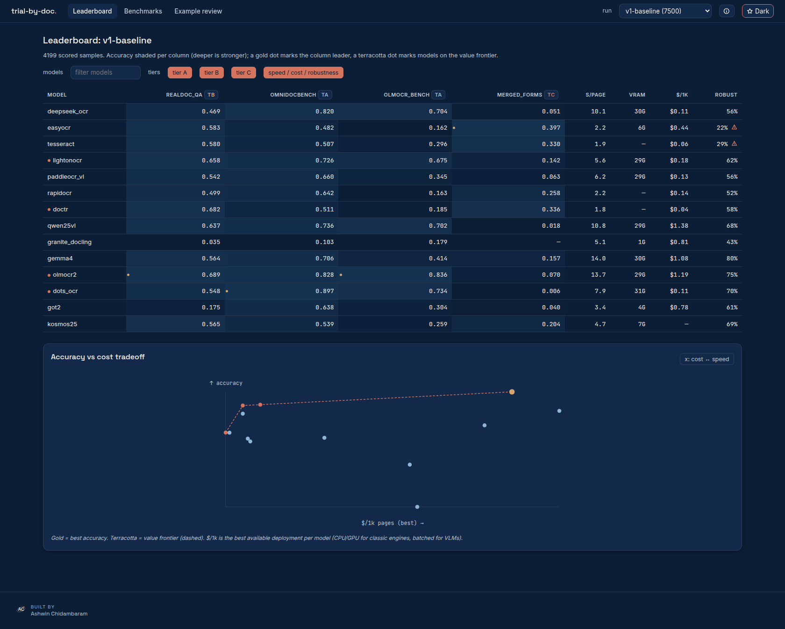

**Diagnose** — per example, every selected model side by side: the page image, each model's
extracted markdown, and the ground truth, with gold values highlighted exactly where the
scorer credits them. Sort worst-first to walk a model's failures. Here olmocr2 and tesseract
both answer a form-field question correctly — `12800` highlighted where each transcribed it —
while tesseract's diagram text visibly degrades.

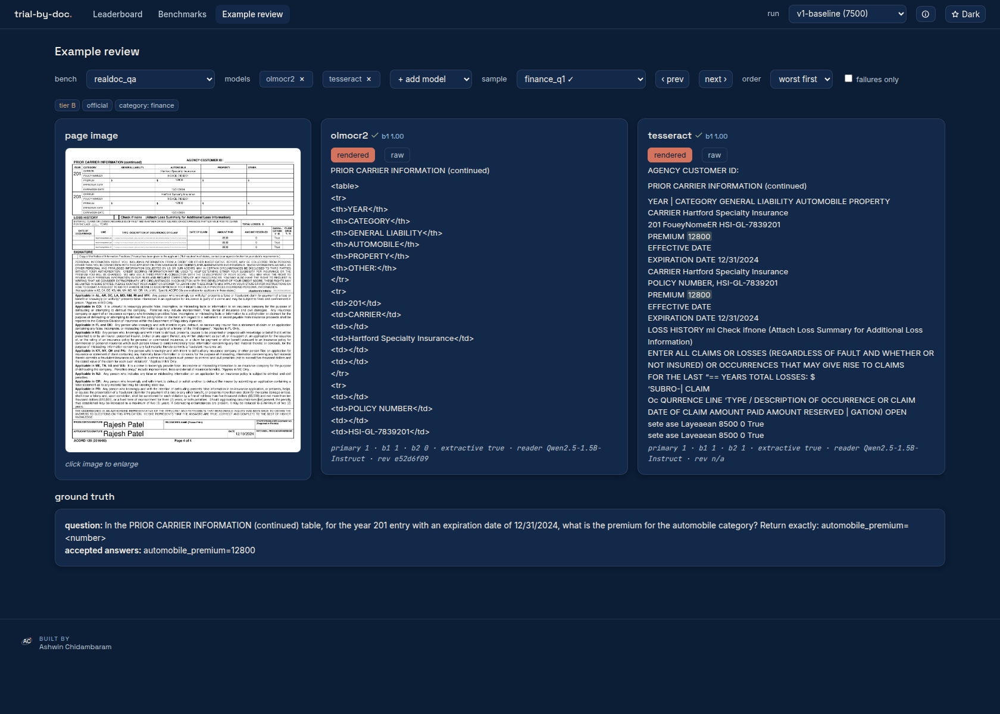

**Explore** — every benchmark's tier, license, scorer, and sample count, with license-gated
example thumbnails (redistributable datasets only) so you can see what each tier tests —
degraded scans included (note the blurred `scanned_heavy` thumbnails).

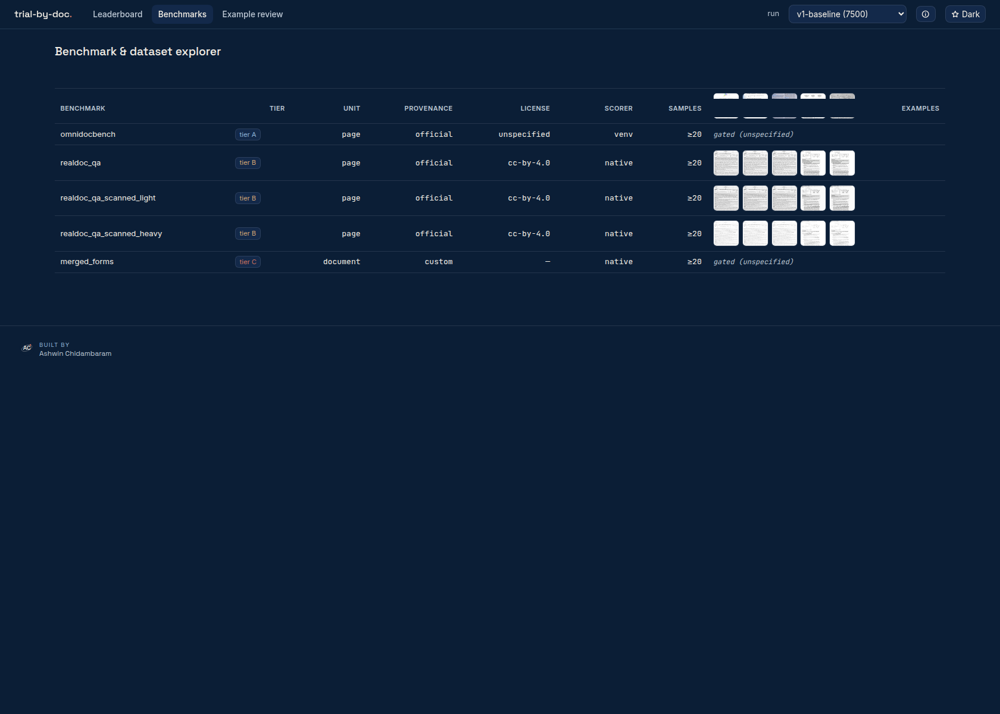

```bash
uv run gauntlet ui                        # serve the latest run at http://127.0.0.1:8000
uv run gauntlet ui --run-id v1-baseline   # a specific run; the run picker switches live
```

On a fresh clone the dashboard renders the published runs from their tracked
`summary.json` aggregates (the leaderboard notes this); the per-example Diagnose
workbench needs a locally scored run, since per-sample records aren't committed.

The dashboard ships light and dark themes; every number matches `gauntlet scoreboard` exactly (it reuses the same readers, never re-deriving a metric).

## Scanned and faxed robustness (Tier B under degradation)

Clean uploads and faxed/scanned copies are different production realities. We re-run the Tier-B
extraction set through a **seeded scan-degradation pipeline** (benches `realdoc_qa_scanned_light`
/ `_heavy`) and score **B.1** (deterministic, reader-independent) on each — so a drop reflects the
*OCR* degrading, not a reader confound. The per-model robustness curve (full write-up:
[findings/partd-scanned-robustness.md](findings/partd-scanned-robustness.md)):

| model | clean | light | heavy | heavy retained |
|---|---|---|---|---|
| olmocr2 | 0.689 | 0.657 | 0.514 | 75% |
| gemma4 | 0.564 | 0.586 | 0.451 | **80%** |
| qwen25vl | 0.637 | 0.676 | 0.436 | 68% |
| doctr | 0.682 | 0.660 | 0.398 | 58% |
| dots_ocr | 0.549 | 0.585 | 0.386 | 70% |
| kosmos25 | 0.565 | 0.517 | 0.390 | 69% |
| lightonocr | 0.658 | 0.602 | 0.408 | 62% |
| paddleocr_vl | 0.542 | 0.497 | 0.305 | 56% |
| deepseek_ocr | 0.469 | 0.451 | 0.261 | 56% |
| rapidocr | 0.499 | 0.495 | 0.261 | 52% |
| tesseract | 0.580 | 0.395 | 0.171 | **29%** |
| easyocr | 0.583 | 0.405 | 0.126 | **22%** |
| got2 | 0.175 | 0.149 | 0.107 | 61% |
| granite_docling | 0.035 | 0.067 | 0.015 | — (noise floor) |

**Takeaway:** VLMs are markedly more scan-robust than classic OCR engines. Under heavy degradation
olmocr2 and gemma4 keep 75–80% of clean extraction, while **tesseract and easyocr collapse to
22–29%** — the classic engines that look competitive on clean digital text are brittle on
scanned/faxed input. docTR is the exception (58% retained), so the split is really tesseract/easyocr,
not "classic engines" as a class. Light degradation is largely absorbed; the cliff is at heavy.
Each cell is n=100 — treat sub-0.03 gaps and the granite noise-floor row as directional.

## Example documents

What the gauntlet actually feeds the models (thumbnails in [`docs/examples/`](docs/examples/);
sources permit redistribution with attribution — OmniDocBench pages are
[browsable upstream](https://huggingface.co/datasets/opendatalab/OmniDocBench) instead,
its card carries no license tag):

**olmOCR-Bench** — seven categories, including the scanned-document cases:

| old scans | scanned math | tables | multi-column |
|---|---|---|---|
| 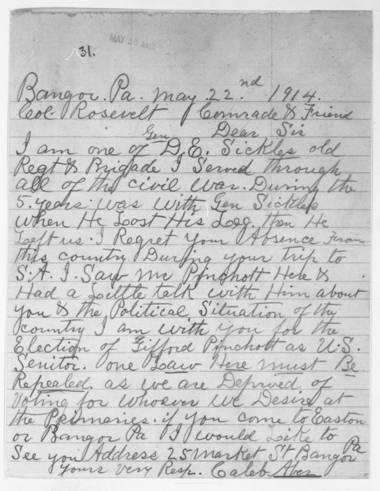 | 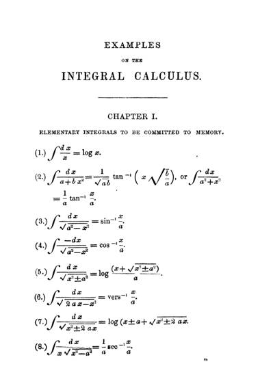 | 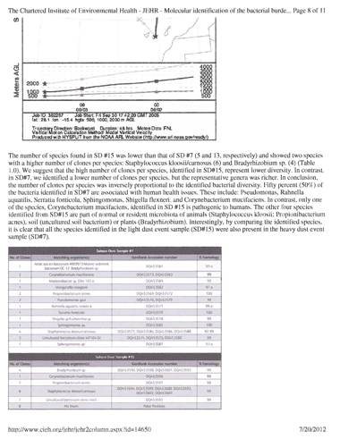 | 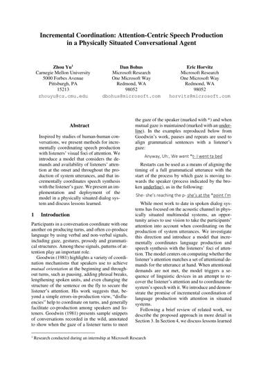 |

(also: `arxiv_math`, `headers_footers`, `long_tiny_text` in the same folder)

**RealDoc-Bench QA** — the business documents Tier B extracts fields from:

| finance | medical | mortgage | supply chain |
|---|---|---|---|
| 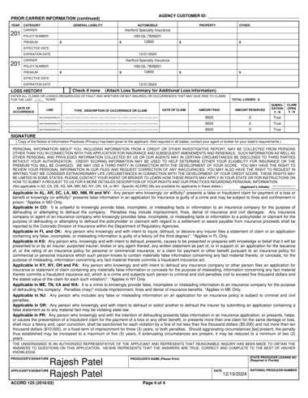 | 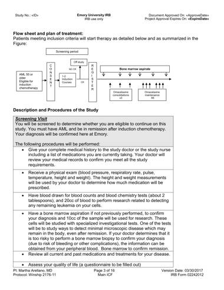 | 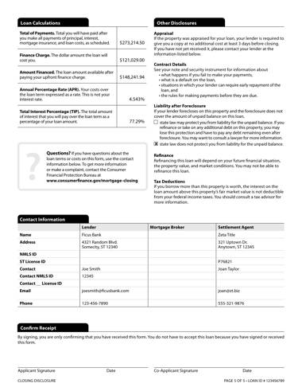 |  |

**merged_forms (Tier C)** — four consecutive stream pages spanning a document
boundary; note the form faces look alike and only the filled content changes:

| page 6 | page 7 | **page 8 — new document starts** | page 9 |
|---|---|---|---|
| 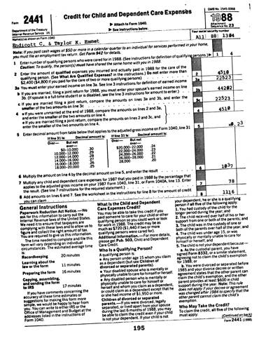 | 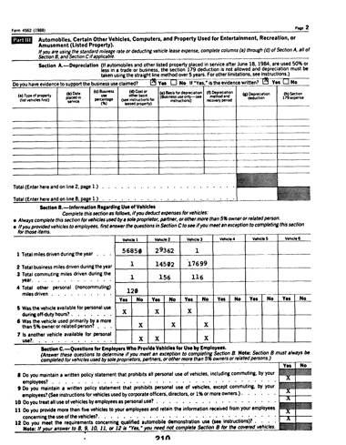 | 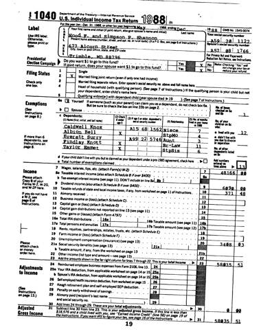 | 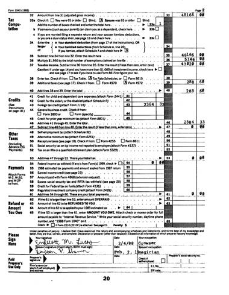 |

> For page-image → parsed-markdown side-by-sides, use the [Dashboard](#dashboard)'s
> Diagnose workbench over a scored run.

## Models

18 model adapters wired via one adapter + one registry entry each (`configs/models.yaml`) —
classic CPU engines, local open-weights VLMs, and commercial APIs (14 scored in
`v1-baseline`; the API fleet is wired but unscored, see [Gaps](#gaps)). A few notable picks; the full
roster (params, license, commercial-use terms, declared specialty) and the Azure self-host
cost tables are in **[docs/REFERENCE.md](docs/REFERENCE.md)**.

| Pick | Model | Why |
|---|---|---|
| Best overall accuracy | [olmOCR-2](https://huggingface.co/allenai/olmOCR-2-7B-1025) | wins Tier A (olmocr_bench) and B.1 extraction |
| Best value | [Tesseract](https://github.com/tesseract-ocr/tesseract) / [docTR](https://github.com/mindee/doctr) | $0.057–$0.173/1k pages (CPU), competitive B.1 |
| Most scan-robust | [Gemma-4-E4B-it](https://huggingface.co/google/gemma-4-E4B-it) | retains 80% of clean accuracy under heavy scan degradation |
| Best document-splitting | [EasyOCR](https://github.com/JaidedAI/EasyOCR) | 0.397 on Tier C (merged_forms), best of the 14 scored — though see the [floor caveat](#tier-c-floor-baselines-most-models-fail-them) |

Usage rights verified against the live model cards / provider terms at pin time (re-verify
before you rely on them — licenses move; see docs/REFERENCE.md for the per-model license
column).

## What the harness actually is

A **two-phase, resumable evaluation matrix** (`gauntlet run` = infer → score):

1. **Infer**: one model in VRAM at a time (API models need no GPU), every benchmark
   page → `predictions/<model>/<bench>.jsonl` with full telemetry (latency, VRAM,
   tokens/s, logprobs; API: cost, version, retries). Multi-question pages are OCR'd
   once and reused.
2. **Score**: per (model, benchmark) batch through the **official scorer wrapped in
   its own isolated venv/container** — never reimplemented, never sharing deps with
   the inference env. Scorer bugfix? `--phase score --rescore` re-scores without
   re-running a single model.

Contracts an adapter implements: `predict(page image) → StructuredDoc(markdown, …)`
(+ optional `segment(pages) → Segmentation` for native splitters). Benchmarks
implement `load() → Samples` and `evaluate() → {"primary": float, …}`.

**What a score means — and doesn't**: Tier A grades the OCR text directly. Tier B
passes it through the frozen extractor, so it measures *parse quality as seen by a
fixed reader* — extractor limitations are shared equally by all models but are in
the loop. Tier C `judge_composed` rows measure per-page parses + the frozen boundary
judge; `native` rows measure the model's own splitter. Every row carries provenance:
model revision (or API version + date), benchmark revision, scorer identity, run id
→ `results/runs/<id>/manifest.json`.

## Setup

Prerequisites: [uv](https://docs.astral.sh/uv/), Python 3.12 (uv fetches it), and — only
for the local-VLM lane — an NVIDIA GPU with ~30 GB VRAM (the classic-engine and scoring
lanes run on CPU with zero API keys). Run every command from the repo root; `gauntlet`
resolves `configs/` and `results/` relative to it.

```bash
git clone https://github.com/ashwinchidambaram/trial-by-doc
cd trial-by-doc
uv sync --extra local              # GPU/open-weights lane (torch + vLLM)
# uv sync --extra api              # API-only lane (no GPU needed)

cp .env.example .env               # add keys only if you use them (see the file's comments)
uv run gauntlet verify-env         # fresh-clone preflight: GPU, version pins, RAM
uv run gauntlet download all       # benchmark data at pinned revisions
uv run gauntlet list models        # see what's wired

uv run gauntlet run --profile smoke      # sanity run (GPU; use --profile smoke_cpu for zero-GPU/zero-key)
uv run gauntlet run --profile v1         # the published 14-model gauntlet (resumable; --run-id to resume)
uv run gauntlet scoreboard               # provenance-stamped results
```

**Compare your model against the published baselines** — no need to re-run the 14
baseline models:

```bash
uv run gauntlet run -m my_model -b realdoc_qa,olmocr_bench --max-samples 100 --run-id mine
uv run gauntlet scoreboard --run-id mine        # your rows
uv run gauntlet scoreboard --run-id v1-baseline # the published rows (renders from tracked summary.json)
```

Read your numbers against the v1-baseline table above (or open both runs in the
[Dashboard](#dashboard)'s run picker). Same benchmarks, same pinned data revisions,
same deterministic scorers — the comparison is apples-to-apples as long as you keep
the per-bench sample caps (`--max-samples 100`; `merged_forms: 15`) so the stratified
sample sets match.

Before any paid run: `uv run gauntlet estimate-cost -m mistral_ocr -b realdoc_qa` —
API spend is estimated up front and hard-capped per model
(`configs/matrix.yaml: budget`) before any call is made, including Tier-B API reader
spend (`--reader gpt5mini` etc.).

Docker (same CLI, zero env setup): `docker/Dockerfile.gpu` (needs
nvidia-container-toolkit; mount your HF cache) and `docker/Dockerfile.cpu` (API
models + scoring). See `docker/compose.yaml`. Scorer containers (e.g. the olmOCR
math/table renderer) run as siblings — mount `/var/run/docker.sock`, or score on
the host with `--phase score`.

**Bring your own model** → [ADD_A_MODEL.md](ADD_A_MODEL.md) (one subclass + one YAML
entry + `uv run gauntlet validate-adapter my_model`). Add a benchmark →
[ADD_A_BENCHMARK.md](ADD_A_BENCHMARK.md).

## Hardware

v1 numbers were produced on a single **RTX 5090 (Blackwell, sm_120)** — driver
595.71.05, CUDA 13.0 runtime, torch 2.11.0+cu130, vLLM 0.22.1, transformers 5.11,
Ubuntu 26.04. The exact fingerprint ships in each run's `manifest.json`. Other GPUs
change throughput/VRAM (and the `enforce_eager` Blackwell workaround may be
unnecessary); scores should reproduce given the pinned revisions and seeds, with the
usual caveat that cross-hardware kernel differences can shift greedy decoding on
rare token ties.

## Gaps

Honest limitations, current as of the v1 baseline. Biggest open item: the **API fleet
(Mistral OCR, Gemini Flash-Lite, Claude/GPT vision) ships validated but unscored** — no API
rows are in the v1-baseline scoreboard yet. Two worth knowing before citing numbers:
**output-token budgets are not equalized** (dots_ocr generates with 4× the token headroom of
most rivals, and the default cap demonstrably binds on dense newspaper pages — part of its
OmniDocBench lead is budget, not parsing), and **no scoreboard cell carries a confidence
interval** (treat sub-0.05 gaps as ties). The full list (DocVQA/DocBench exclusions,
OmniDocBench CDM, blocked adapters, granite_docling's Tier-C OOM, merged_forms' synthesized
provenance, instrument coupling, developer-affiliated benchmarks, statistical power, and more)
is at **[docs/REFERENCE.md#gaps](docs/REFERENCE.md#gaps)**.

## Glossary

Reference definitions for terms used throughout — jump back here any time; the term is
usually linked from wherever it's first used.

**Metrics**

- **ANLS** — Average Normalized Levenshtein Similarity. A fuzzy string-match metric
  (0–1) used for QA/extraction: rewards near-misses (typos, minor formatting
  differences) instead of requiring a byte-exact answer.
- **TEDS** — Tree Edit Distance-based Similarity. A structural metric for table
  extraction: compares a predicted table against the gold table as a tree of
  rows/columns/cells, not as raw text.
- **Edit distance** — Levenshtein-style character/token edit distance between
  predicted and gold text; the core Tier-A parse-fidelity signal, reported here as a
  normalized similarity (higher = closer match).
- **PQ (Panoptic Quality)** — a segmentation metric adapted from panoptic image
  segmentation for document/page-stream segmentation (Tier C): rewards correctly
  detecting document boundaries *and* getting their extent right, symmetrically
  penalizing over- and under-segmentation.
- **STP** — a stricter document-stream segmentation metric (from the TABME++ /
  LLM-for-PSS line of work) checking whether a predicted document's page span
  exactly matches a gold document's span, all-or-nothing per document.
- **CDM (Character Detection Matching)** — an OmniDocBench v1.5+ formula-rendering
  metric requiring a TeX Live container; excluded here (see [Gaps](#gaps)) in favor of
  the official edit-distance + TEDS set.

**Harness concepts**

- **Frozen instrument** — an LLM used only to *score or extract*, never a model under
  test: pinned revision, temperature 0, seeded, identical for every model in the
  roster. The Tier-B extractor and Tier-C boundary judge are this harness's two
  frozen instruments.
- **Official vs. custom (provenance)** — *official* = third-party dataset + third-party
  scorer, wrapped unmodified; *custom* = we own the ground truth and the scorer
  (requires a `VALIDATION.md`, e.g. `merged_forms`). Every scoreboard row is labeled
  with which applies.
- **Extractive (item)** — a QA item whose gold answer literally appears as text on the
  page, as opposed to one requiring inference or computation. B.1 scores only the
  extractive subset, since it's checking for verbatim presence.
- **Coverage** — how many of a benchmark's items are extractive (and therefore
  B.1-scorable) out of the total; shown as `n/100` in the Tier-B breakdown table.
- **`judge_composed` vs. `native` (Tier C)** — `judge_composed` rows build a
  segmentation from per-page OCR text plus the frozen boundary judge; `native` rows
  use a model's own built-in document-splitting output instead. Both are scored the
  same way but measure different things.
- **Boundary judge** — the frozen instrument (pinned Qwen2.5-7B-Instruct) that decides,
  given two adjacent OCR'd pages, whether a new document starts — the primitive
  behind `judge_composed` Tier-C rows.
- **`gold_match`** — in the Diagnose dashboard view, whether a gold answer was found
  verbatim in a model's markdown for a given question (the same check B.1 scoring
  performs); computed only for extractive items, so it lines up exactly with what B.1
  credits.

**Reproducibility concepts**

- **`run_id`** — the identifier for one evaluation run (e.g. `v1-baseline`); all its
  artifacts (predictions, scores, manifest) live under `results/runs/<run_id>/`.
- **`manifest.json`** — the per-run provenance record: model fingerprints (revision or
  API version + date), benchmark dataset revisions, scorer identity, seeds, and
  hardware fingerprint — everything needed to say exactly what produced a given
  number.
- **Revision pin** — an exact, verified model/dataset commit hash (or API version),
  recorded rather than trusting a moving `main`/`latest` tag — the "verify, never
  assume" rule in practice.

**Licensing shorthand**

- **ODC-BY** — Open Data Commons Attribution License; the license olmOCR-Bench ships
  under (attribution required, otherwise unrestricted use).

## Attributions & credits

This harness stands on other people's careful work:

**Benchmarks & datasets**
- [olmOCR-Bench](https://huggingface.co/datasets/allenai/olmOCR-bench) — Allen Institute for AI, **ODC-BY 1.0** (attribution required — thank you AI2). Scored by the official [`olmocr[bench]`](https://github.com/allenai/olmocr) runner.
- [OmniDocBench](https://github.com/opendatalab/OmniDocBench) — OpenDataLab / Shanghai AI Lab (CVPR 2025). Scored via the official repo pipeline (Apache-2.0 code); dataset card carries no license tag (verified 2026-07-07) — evaluation use only, not redistributed.
- [RealDoc-Bench](https://huggingface.co/datasets/Extend-AI/RealDoc-Bench) — Extend-AI, **CC BY 4.0**.
- [NIST Special Database 2](https://www.nist.gov/srd/nist-special-database-2) (SFRS) — U.S. National Institute of Standards and Technology; U.S. Government work. Raw material for `merged_forms`.
- Segmentation metrics: **Panoptic Quality for PSS** from van Heusden, Kamps & Marx, *OpenPSS* (TPDL 2024, doi:10.1007/978-3-031-72437-4_24); **STP** from *LLMs for Page Stream Segmentation* (arXiv:2408.11981, TABME++).

**Models** — Allen Institute for AI (olmOCR-2), Alibaba Qwen (Qwen2.5-VL; Qwen2.5-7B-Instruct is also our frozen instrument), StepFun (GOT-OCR 2.0), rednote-hilab (dots.ocr), PaddlePaddle (PaddleOCR-VL), DeepSeek (DeepSeek-OCR), IBM (granite-docling), LightOn (LightOnOCR), Mistral AI, Google, Anthropic, OpenAI.

**Lineage** — harness contracts (adapter/benchmark seams, scorer isolation,
provenance stamping) evolved from the author's `of-course-i-can-parse-that`
distillation project.

Harness code: MIT. Benchmark data keeps its own licenses (links above);
nothing restrictive is redistributed here.
